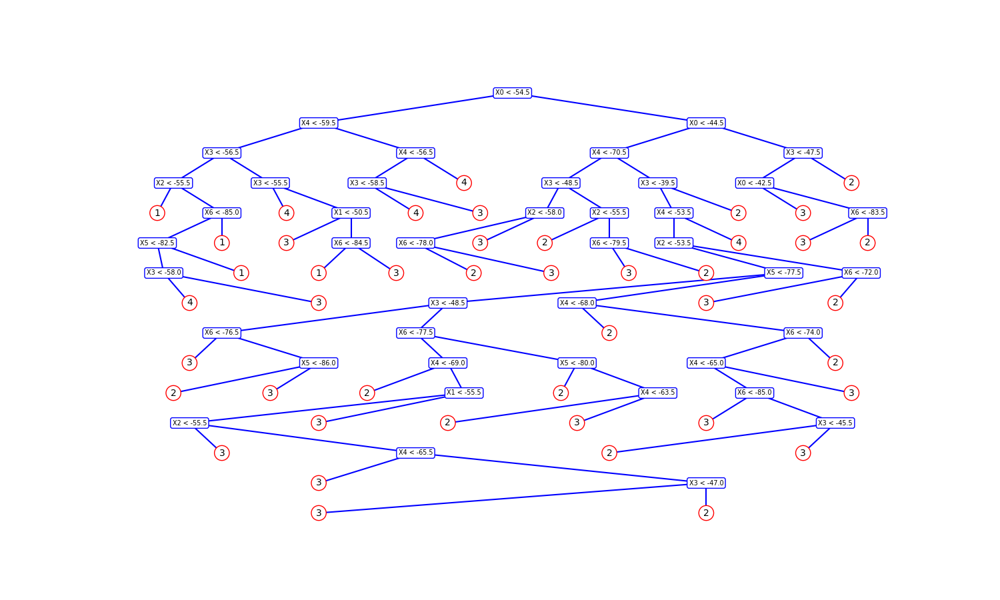
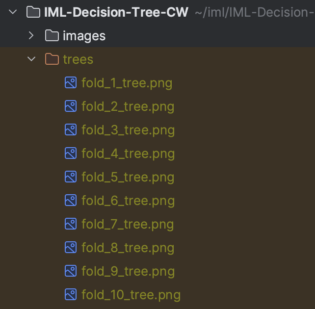

# IML Decision Tree CW



Authors:
* Johns Noble
* Shreya Kamath
* Indira Thanigaikumar
* Sumith Salluri

<details>
  <summary>Table of Contents</summary>
  <ol>
    <li><a href="#about-the-project">About The Project</a></li>
    <li><a href="#libraries">Libraries</a></li>
    <li><a href="#getting-started">Getting Started</a></li>
    <li><a href="#usage">Usage</a></li>
  </ol>
</details>


## About

This is a decision tree training program.


### Libraries 

* numpy
* matplotlib


## Getting Started

Make sure you have python3, numpy and matplotlib installed.

In order to train on the clean data, from the root directory, run:
```sh
python3 fit_Data.py 
```

To train on a data set of your own:
```sh
python3 fit_Data.py --dataset=your-data-set.txt
```

Command Line Arguments:
* `--dataset="your_data_set.txt"` (default=`"wifi\_db/clean\_dataset.txt"`)
* `--save_diagrams=True` (default=`False`)

## Usage

For example:
```
% python3 fit_data.py --save_diagrams=True
```

Outputs:

```
FOLD 1
test data range: 0, 200
trained tree of depth 14
TIME ELAPSED FOLD 1 0.05700100000000008s
------------------------------------------------
FOLD 2

...
(output for each fold)
(measurements for each class/room predictions)
...


f1 measure:  0.9103869653767822
 
class:  4 
precision:  0.9763313609467456
recall:  0.99
f1 measure:  0.9831181727904666
```

And also saves the following diagrams to the directory `trees/`:


